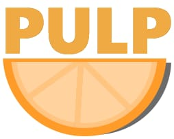

# PULP

>_Pulp is a list of the best libraries to add some flair to your projects.
Its the bounce and ease of animation, the haptic feedback on touch and the ripple on hover.
These features are don't provide core functionality to a project 
but add a level of polish which brings the experience to life._
:+1:

## Animation

**[tween.js](https://github.com/tweenjs/tween.js/)**
JavaScript tweening engine for easy animations.

## Graphics

## Colour

## Sounds

**[Tone.js](https://github.com/Tonejs/Tone.js)**
A Web Audio framework for making interactive music in the browser.

## Misc
**[Splain.js](https://github.com/mog13/Splain)**
A small parser to creat dynamic and interesting language/sentances
